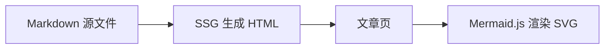

本文档汇总了常用 Markdown 语法在 Blog SSG 中的渲染效果，便于检查排版与样式。

## 标题与段

# 一级标题（正文内）

## 二级标题

### 三级标题

#### 四级标题

这是普通段落。Markdown 是**唯一内容源**，支持 *斜体*、**粗体**、~~删除线~~，以及 `行内代码` 混排。

第二段演示换行与间距。Blog SSG 使用 [marked](https://marked.js.org/) 将 Markdown 转为 HTML，再套用 `article.css` 样式。

---

## 引用

> 这是一段引用文字。
>
> 引用可以包含 **强调** 与 [链接](https://github.com/lymtu)。
>
> > 嵌套引用也支持。

## 列表

无序列表：

- 第一项
- 第二项
  - 嵌套子项 A
  - 嵌套子项 B
- 第三项

有序列表：

1. 安装依赖：`bun install`
2. 构建前端：`bun run build`
3. 启动服务：`bun run dev`

任务列表（GFM）：

- [x] 已完成：front matter 解析
- [x] 已完成：文章 HTML 生成
- [ ] 待办：继续写更多文章

## 代码

行内代码示例：`const url = "/demo/markdown-showcase"`。

代码块：

```typescript
import { rebuildAll } from "./src/services/ssg.ts";

await rebuildAll();
console.log("所有文章 HTML 已重新生成");
```

```bash
bun run build
bun run dev
```

```json
{
  "title": "Markdown 样式展示",
  "category": "demo"
}
```

## 表格

| 元素 | 语法 | 说明 |
| --- | --- | --- |
| 标题 | `# H1` ~ `#### H4` | 六级标题均可写，站点样式覆盖 h1–h4 |
| 链接 | `[text](url)` | 品牌色下划线 |
| 代码 | `` `code` `` | 浅底 + 边框 |
| 表格 | `\| col \|` | 全宽、圆角边框 |
| Mermaid | ` ```mermaid ` | 客户端渲染为 SVG 图表 |

## Mermaid 图表



## 图片


## 分隔线与混排

段落末尾的分隔线下方，是一段**混排**示例：查看 `article.css` 中的 `.article-content` 规则，或访问 [首页](/)。

---

*文档结束。若样式有偏差，优先检查 `frontend/src/assets/style/article.css`。*
